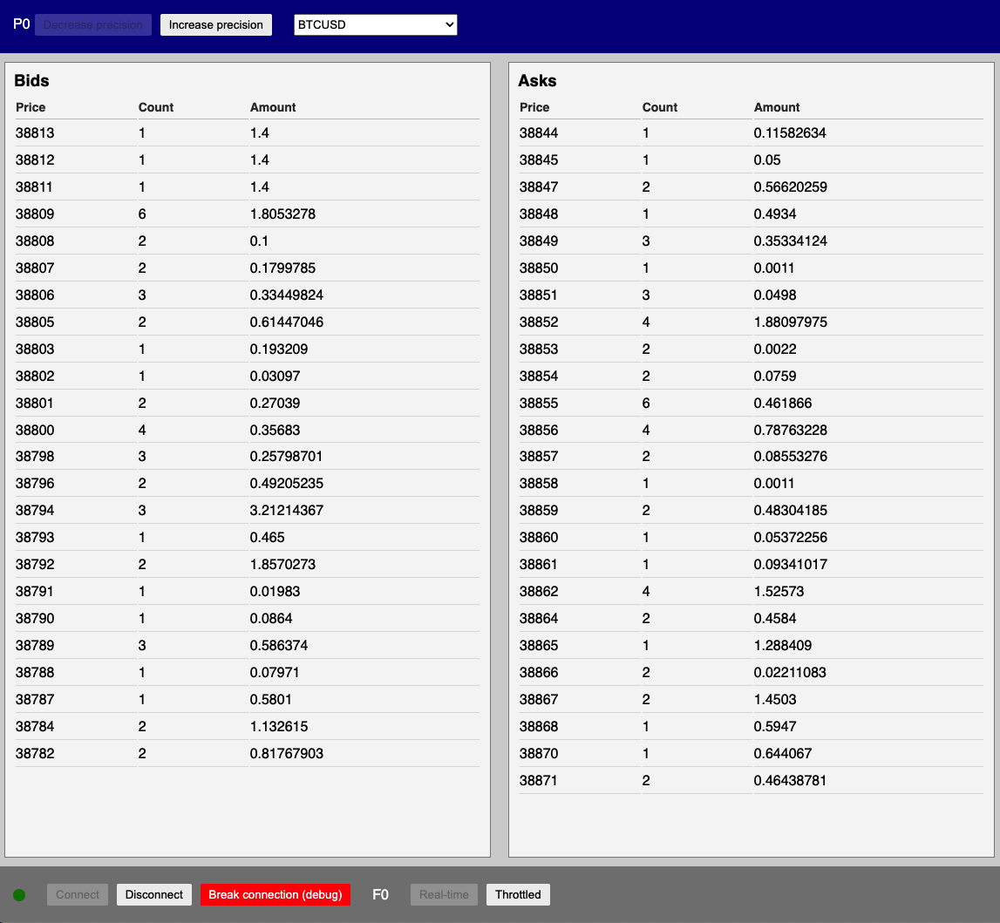

# Bitfinex test app

### The project is to mimic the Bitfinex Order book widget using its API.

1. Install deps via npm or yarn: `npm install` or `yarn`
2. Start page by running `yarn serve`
This will start Webpack Dev Server with proxy configured to workaround CORS when running server requests.
The host is [http://localhost:8080](http://localhost:8080)

Features:
- Connects to API by clicking "Connect" button
- Disconnects by clicking "Disconnect"
- Loads available symbols on start via XHR
- Reconnects every time any of these values change: precision, symbol or frequency
- Sorts prices ASC for Bids and DESC for Asks
- The most of data is stored in Redux store
- The combination of hooks and Redux is used
- Styled Components are used for styling

Other notes:
1. I used TypeScript and added some very basic types in order to save time so some non-critical type errors 
are in the code which don't break compilation.
2. I added a dropdown to select any symbol that is available via API.
3. I added a red button to test reconnection. It can be combined with Chrome > Dev Tools > Network > Throttling 
as Chrome now supports throttling Websocket connections.
4. Often it happens that a message causing removing a row comes before the moment when some other data becomes 
available to fill it in, so it can be noticed in the UI when the rows jump up and down. Can be treated with some
workarounds but was not a high priority so I didn't do this.
